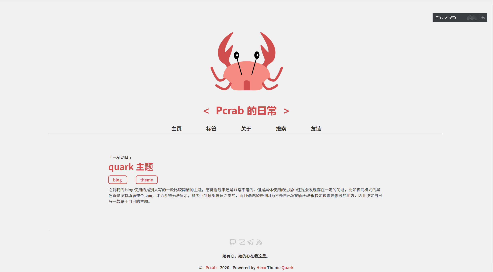

> 之前我的 blog 使用的是别人写的一款比较简洁的主题，感觉看起来还是非常不错的，但是具体使用的过程中还是会发现存在一定的问题，比如夜间模式的黑色背景没有填满整个页面，评论系统无法显示，缺少回到顶部按钮之类的，而且修改起来也因为不是自己写的而无法很快定位需要修改的地方，因此决定自己写一款属于自己的主题。



## 介绍

这款主题是一款黑色系的主题，看起来十分稳重，目前还在开发中，还没有加入处评论系统外的任何js。可配置项基本都在 config 文件中有，还有具体例子，使用起来非常简单。主题整合了 Valine 这款优秀的评论系统，防病使用

## 安装

```bash
git clone https://github.com/Pcrab/hexo-theme-quark quark
```

同时记得将**主目录**下的 `_config.yml_` 文件中的 theme 修改为 quark

```yaml
theme: quark
```

## 修改

`_config.yml` 文件中有着丰富的可配置项，方便个性化配置，包括

1. `title`: 网站标题
2. `site`: 网站地址
3. `icon`: 主页图标支持
4. `author`: 作者介绍 (即 about 页面)
5. `menus`: 导航栏菜单
6. `links`: 友链 (开发中)
7. `comment`: 评论系统支持
8. `copyright`: 版权支持
9. `startYear` 以及 `showTheme`: 部分页脚内容自定义

## 插件

请安装下列插件以获得最好的体验：

[hexo-generator-searchdb](https://github.com/theme-next/hexo-generator-searchdb)

[hexo-generator-feed](https://github.com/hexojs/hexo-generator-feed)

其他插件请自行安装配置
